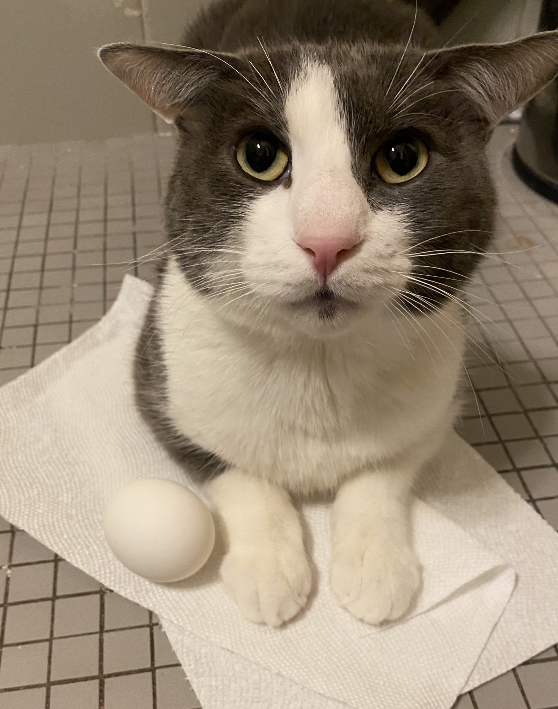

# brukerstøtte 2025-2026

Jeg er Tim og dette min repository for brukerstøtte faget.

Jeg går på Informasjonsteknologi linjen på ASVG i klassen 2ITKA.

Mine programerings prosjekter ligger på Github [her](https://github.com/Oksnes).

<br><br>

Min favorite kode noensinne
```cS
private bool IsEven(int number){
    if (number == 1) return false;
    else if (number ==2 ) return true;
    else if (number ==3 ) return false;
    else if (number ==4 ) return true;
    else if (number ==5 ) return false;
    else if (number ==6 ) return true;
    else if (number ==7 ) return false;
    else if (number ==8 ) return true;
    else if (number ==9 ) return false;
    else if (number ==10 ) return true;
    else if (number ==11 ) return false;
    else if (number ==12 ) return true;
    else if (number ==13 ) return false;
    else if (number ==14 ) return true;
    else if (number ==15 ) return false;
    else if (number ==16 ) return true;
    else if (number ==17 ) return false;
    else if (number ==18 ) return true;
}
```

<!--  -->